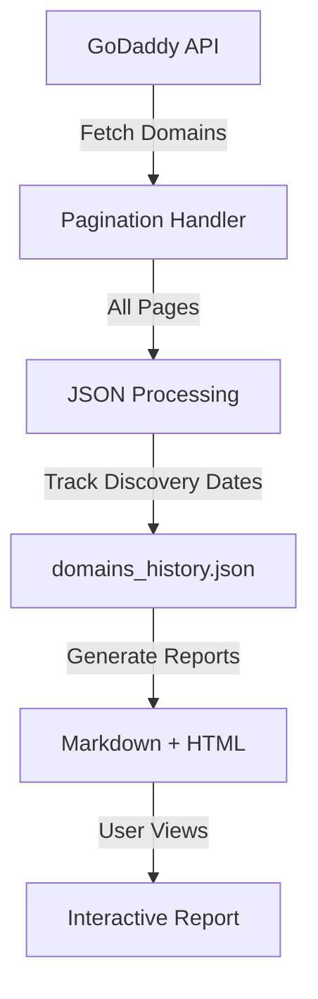
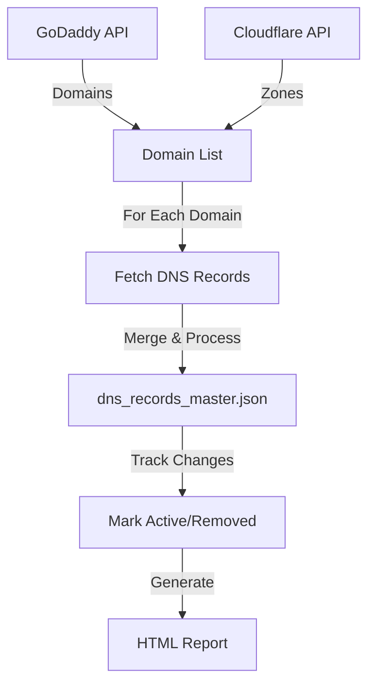
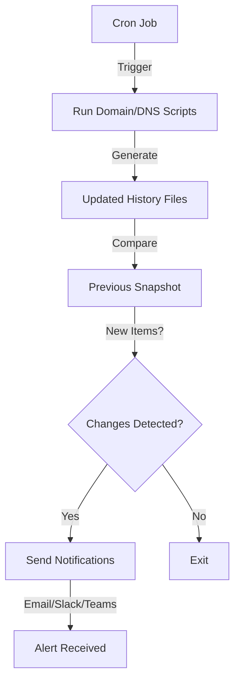

# 0xDomainSnapshot

A comprehensive toolkit for managing and monitoring your GoDaddy and Cloudflare domain assets. Track domains, DNS records, and receive notifications when changes occur.

[](https://www.buymeacoffee.com/0xDTC)

---

## Overview

**0xDomainSnapshot** provides three main components:

1. **Domain Pull** - Fetch and track all domains from your GoDaddy account
2. **Subdomain Pull** - Inventory all DNS records from GoDaddy and Cloudflare
3. **Monitoring & Notifications** - Get alerts via Email, Slack, or Microsoft Teams when new assets are discovered

## Features

✅ **Domain Management**
- Fetch all domains from GoDaddy with pagination support
- Track domain status (ACTIVE, CANCELLED, PENDING_TRANSFER, etc.)
- Monitor domain discovery dates
- Export to Markdown and interactive HTML

✅ **DNS Record Inventory**
- Retrieve DNS records from both GoDaddy and Cloudflare
- Support for all record types (A, CNAME, MX, TXT, etc.)
- Track record discovery dates and changes
- Identify removed/inactive records
- Advanced filtering and search in HTML reports

✅ **Notifications**
- Email alerts for new domains and DNS records
- Slack integration with rich formatting
- Microsoft Teams webhooks support
- Customizable notification frequency

✅ **Interactive Reports**
- Sortable and filterable HTML tables
- Export to CSV functionality
- Responsive design for mobile and desktop
- Dark/light mode support (where applicable)

---

## Quick Start

### Prerequisites

**System Requirements:**
- Bash shell environment (Linux/macOS/WSL)
- Python 3.8+ (for Subdomain Pull)
- `jq` for JSON processing
- `curl` for API calls

**Install dependencies:**

```bash
# Debian/Ubuntu
sudo apt install jq curl python3 python3-pip

# macOS
brew install jq curl python3

# Python dependencies (for Subdomain Pull)
pip3 install requests python-dotenv
```

**API Credentials:**
- GoDaddy API Key and Secret ([Get them here](https://developer.godaddy.com/keys))
- Cloudflare API Token ([Create one here](https://dash.cloudflare.com/profile/api-tokens))

### Installation

1. **Clone the repository:**
   ```bash
   git clone https://github.com/0xDTC/0xDomainSnapshot.git
   cd 0xDomainSnapshot
   ```

2. **Configure API credentials:**

   Edit `secret.txt` with your credentials:
   ```bash
   GODADDY_API_KEY='your_godaddy_api_key'
   GODADDY_API_SECRET='your_godaddy_api_secret'
   CLOUDFLARE_API_TOKEN='your_cloudflare_api_token'
   CLOUDFLARE_ACCOUNT_ID='your_cloudflare_account_id'
   ```

3. **Make scripts executable:**
   ```bash
   chmod +x "Domain Pull/GDomains"
   chmod +x "Serve/Email" "Serve/Slack" "Serve/Teams"
   ```

---

## Usage

### 1. Domain Pull

Fetch all domains from your GoDaddy account.

```bash
cd "Domain Pull"
./GDomains
```

**Output:**
- `domains_history.json` - Complete domain history with discovery dates
- `GDdomain.md` - Markdown formatted report
- `GDdomain.html` - Interactive HTML report with filtering and sorting

**Features:**
- Automatic pagination for large domain portfolios
- Status aggregation (ACTIVE, CANCELLED, etc.)
- Discovery date tracking
- Interactive HTML with search, sort, and CSV export

### 2. Subdomain Pull (DNS Inventory)

Retrieve all DNS records from GoDaddy and Cloudflare.

```bash
cd "Subdomain Pull"
python3 subdomains.py
```

**Options:**
- `--log` - Enable verbose logging
- `-g, --godaddy` - Fetch only from GoDaddy
- `-c, --cloudflare` - Fetch only from Cloudflare
- `--debug` - Enable debug mode

**Output:**
- `data/dns_records_master.json` - Complete DNS inventory
- `DNS_Inventory.html` - Interactive HTML report

**Features:**
- Retrieves ALL DNS records with full pagination
- Tracks record discovery dates
- Marks removed/inactive records
- Merges data from both providers
- Handles rate limiting gracefully
- Interactive DataTables with advanced filtering

### 3. Monitoring & Notifications

Set up automated monitoring to receive alerts when new domains or DNS records are discovered.

#### Email Notifications

```bash
cd Serve
./Email [--send-test]
```

**Configuration:**
Edit the script to set:
- SMTP server settings
- Email addresses (from/to)
- Maximum items per email

#### Slack Notifications

```bash
cd Serve
./Slack [--send-test]
```

**Configuration:**
1. Create a Slack webhook: https://api.slack.com/messaging/webhooks
2. Edit the script and set `SLACK_WEBHOOK_URL`
3. Customize channel, username, and emoji

#### Microsoft Teams Notifications

```bash
cd Serve
./Teams [--send-test]
```

**Configuration:**
1. Create an Incoming Webhook in Teams
2. Edit the script and set `TEAMS_WEBHOOK_URL`

#### Automated Monitoring

Set up a cron job to run monitoring scripts periodically:

```bash
# Edit crontab
crontab -e

# Add these lines (adjust paths):
# Run domain check daily at 9 AM
0 9 * * * /path/to/0xDomainSnapshot/Domain\ Pull/GDomains
0 9 * * * /path/to/0xDomainSnapshot/Serve/Slack

# Run DNS check every 6 hours
0 */6 * * * cd /path/to/0xDomainSnapshot/Subdomain\ Pull && python3 subdomains.py
5 */6 * * * /path/to/0xDomainSnapshot/Serve/Email
```

---

## Project Structure

```
0xDomainSnapshot/
├── Domain Pull/
│   ├── GDomains              # Bash script to fetch domains
│   ├── README.md             # Domain Pull documentation
│   └── domains_history.json  # Generated: Domain tracking data
│
├── Subdomain Pull/
│   ├── subdomains.py         # Python script for DNS inventory
│   ├── README.md             # Subdomain Pull documentation
│   ├── static/
│   │   ├── datatables.js     # DataTables JavaScript
│   │   └── style.css         # Custom styles
│   └── data/
│       └── dns_records_master.json  # Generated: DNS inventory
│
├── Serve/
│   ├── Email                 # Email notification script
│   ├── Slack                 # Slack notification script
│   └── Teams                 # Microsoft Teams notification script
│
├── secret.txt                # API credentials (DO NOT COMMIT)
├── .gitignore                # Git ignore rules
└── README.md                 # This file
```

---

## Data Flow

### Domain Pull Flow



### Subdomain Pull Flow



### Monitoring Flow



---

## Configuration

### API Rate Limits

**GoDaddy:**
- 60 requests per minute
- Daily quota varies by account type
- Script includes automatic rate limiting

**Cloudflare:**
- 1200 requests per 5 minutes
- Script includes exponential backoff

### Customization

**Domain Pull (`GDomains`):**
- `PAGE_SIZE` - Domains per API request (default: 1000)
- Output file locations can be customized

**Subdomain Pull (`subdomains.py`):**
- `REQUEST_TIMEOUT` - API timeout in seconds (default: 60)
- `MAX_RETRIES` - Retry attempts (default: 5)
- `BACKOFF_FACTOR` - Exponential backoff multiplier (default: 1.5)

**Notifications:**
- `MAX_ITEMS_IN_EMAIL` - Max items per email (default: 25)
- `MAX_ITEMS_IN_MESSAGE` - Max items per Slack message (default: 15)

---

## Security Best Practices

🔒 **Protect Your Credentials:**
- Never commit `secret.txt` to version control
- Use environment variables in production
- Restrict file permissions: `chmod 600 secret.txt`

🔒 **API Security:**
- Rotate API keys regularly
- Use API tokens with minimal required permissions
- Monitor API usage for unusual activity

🔒 **Notification Security:**
- Use secure webhook URLs (HTTPS only)
- Don't include sensitive data in notifications
- Limit notification recipients

---

## Troubleshooting

### Common Issues

**Issue: "API quota exceeded"**
- Solution: Wait for quota reset or upgrade GoDaddy account
- The script will continue with Cloudflare data if GoDaddy fails

**Issue: "jq: command not found"**
- Solution: Install jq (`sudo apt install jq` or `brew install jq`)

**Issue: "Invalid JSON in history file"**
- Solution: Delete the history file - it will be recreated automatically

**Issue: Python dependencies missing**
- Solution: `pip3 install requests python-dotenv`

**Issue: Webhook notifications not working**
- Solution: Run with `--send-test` flag to verify configuration

### Debug Mode

Enable logging for troubleshooting:

```bash
# Domain Pull - output is verbose by default

# Subdomain Pull
python3 subdomains.py --log --debug

# Notifications - check log files in Serve/ directory
tail -f Serve/*.log
```

---

## Contributing

Contributions are welcome! Please:

1. Fork the repository
2. Create a feature branch
3. Make your changes
4. Test thoroughly
5. Submit a pull request

---

## License

This project is provided as-is for educational and operational purposes. Please ensure compliance with GoDaddy and Cloudflare Terms of Service when using their APIs.

---

## Support

- **Issues:** [GitHub Issues](https://github.com/0xDTC/0xDomainSnapshot/issues)
- **Discussions:** [GitHub Discussions](https://github.com/0xDTC/0xDomainSnapshot/discussions)
- **Support the project:** [Buy me a knowledge](https://www.buymeacoffee.com/0xDTC)

---

## Roadmap

- [ ] Add support for other DNS providers (Route53, DigitalOcean)
- [ ] Web dashboard for visualization
- [ ] Diff viewer for tracking changes over time
- [ ] Export to additional formats (PDF, Excel)
- [ ] Integration with security tools (SIEM, vulnerability scanners)
- [ ] Automated SSL certificate monitoring
- [ ] Subdomain enumeration and validation

---

## Changelog

### Version 2.0 (Current)
- Rewritten Subdomain Pull in Python for better performance
- Added comprehensive pagination support
- Improved error handling and rate limiting
- Enhanced HTML reports with DataTables v2
- Added discovery date tracking
- Support for marking removed records

### Version 1.0
- Initial Bash-based implementation
- Basic domain and subdomain fetching
- Email notification support

---

## Acknowledgments

- Built with ❤️ by [0xDTC](https://github.com/0xDTC) which is me guys.
